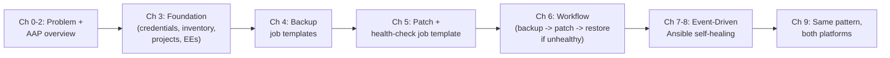

# Chapter 0: The Use Case

## The problem

Every patch cycle, a VM administration team works through the same
checklist for each virtual machine in the fleet:

1. **Take a backup** — usually a point-in-time snapshot — so there's a known
   good state to fall back to.
2. **Apply OS patches** — security updates, kernel updates, package updates.
3. **Reboot and verify** — confirm the VM comes back up and the critical
   services on it are healthy.
4. **If something breaks** — a service won't start, a dependency conflict
   breaks an application, a kernel update causes a boot failure — **restore
   the VM from the backup taken in step 1**.

Done by hand, across a large fleet, this is:

- **Slow** — each VM is handled sequentially, by a person, often during a
  narrow maintenance window.
- **Inconsistent** — the exact steps (snapshot naming, which services to
  check, how long to wait before declaring "healthy") vary from admin to
  admin.
- **Risky under pressure** — if a patch breaks a VM at 2 AM, the restore is
  also done manually, under time pressure, which is exactly when mistakes
  happen.
- **Duplicated across platforms** — the team runs this same process on two
  different virtualization platforms with two different toolsets:

| | **Red Hat OpenShift Virtualization** | **VMware vSphere** |
|---|---|---|
| VM representation | `VirtualMachine` custom resource on Kubernetes/OpenShift | VM object managed by vCenter |
| Backup primitive | `VirtualMachineSnapshot` custom resource | vSphere snapshot |
| Restore primitive | `VirtualMachineRestore` custom resource | Revert to snapshot |
| Admin tooling | `oc` / `kubectl`, OpenShift web console | `govc`, vSphere Client, PowerCLI |

The *intent* is identical on both platforms — **back up, patch, verify,
restore-if-needed** — but the *mechanics* differ, and today that means two
separate manual runbooks maintained by two separate teams.

## The goal

Automate the entire loop with **Ansible Automation Platform**, so that:

- Backup, patch, and restore become **repeatable, auditable job templates**
  instead of runbooks.
- The "patch → verify → restore if needed" logic becomes a single
  **workflow** that runs unattended.
- The same logical workflow works for **both OpenShift Virtualization and
  VMware**, with the platform-specific differences isolated to a small,
  swappable layer.
- Eventually, the team doesn't even need to *run* anything — **Event-Driven
  Ansible** watches for signs of trouble after a patch and triggers the
  restore automatically, even if that trouble shows up well after the
  patch job finished.

## Where this demo is going

By the end of Chapter 6, this use case is fully automated as an on-demand
workflow. By the end of Chapter 8, it's automated **and self-healing** —
the platform reacts to problems on its own. Chapter 9 then steps back and
shows how the *same* pattern serves both OpenShift Virtualization and
VMware with minimal duplication.

The next chapter introduces Ansible Automation Platform itself and maps its
pieces directly onto this use case.
