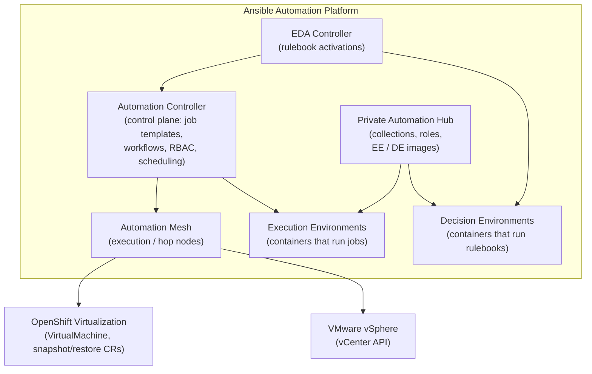

# Chapter 1: Introducing Ansible Automation Platform

## What AAP is

**Red Hat Ansible Automation Platform (AAP)** is an enterprise platform for
building, running, and scaling automation. It takes the open-source Ansible
engine and wraps it with everything an organization needs to run automation
safely and repeatedly:

- A **central place to define and launch automation** (job templates,
  workflows, scheduling, RBAC, audit logs).
- A **controlled, versioned way to package what automation needs to run**
  (Execution Environments — containers with Ansible plus the exact
  collections and dependencies a job needs).
- A **private, curated store of automation content** (Private Automation
  Hub — collections, roles, execution environment images).
- A way to **react to events from the infrastructure itself**, not just run
  jobs on a schedule or on demand (Event-Driven Ansible).
- A way to **reach infrastructure across network boundaries** without
  exposing every node directly (Automation Mesh).

Each of these pieces is described in detail in
[Chapter 2](02-aap-components.md). For now, the important idea is this:

> AAP separates **what to automate** (playbooks, roles, collections),
> **where it runs** (Execution Environments), and **who can run what,
> against what, and when** (Automation Controller) — and adds an
> **event-driven layer** that can trigger automation on its own.

## High-level architecture

## How this maps to our use case

Recall the loop from [Chapter 0](00-the-use-case.md): **backup → patch →
health-check → restore-if-needed**, on two different platforms. Here's how
AAP's pieces line up against that, at a glance — each row is expanded fully
in Chapter 2:

| AAP piece | Role in this use case |
|---|---|
| **Automation Controller** | Hosts the job templates for backup, patch, and restore, and the workflow that chains them together. Provides one set of credentials, schedules, and audit logs for *both* platforms. |
| **Execution Environments** | Two small container images — one with the collections needed to talk to OpenShift Virtualization, one with the collections for VMware — so jobs always run with the right tooling. |
| **Private Automation Hub** | Stores those Execution Environment images and the custom collections/roles used by the playbooks, version-pinned. |
| **Automation Mesh** | Lets the control plane reach the OpenShift Virtualization cluster and the vCenter environment, even if they sit in different network segments. |
| **EDA Controller / Decision Environments** | Watches for post-patch health alerts and triggers the restore workflow automatically — covered in Chapters 7–8. |

## Why a single platform matters here

Without AAP, the OpenShift Virtualization team and the VMware team each
maintain their own scripts, their own credentials storage, and their own
ad-hoc "what do we do if the patch fails" runbook. With AAP:

- **One inventory** describes both fleets (grouped by platform).
- **One set of job templates** (backup, patch, restore) exists per
  platform, but they're launched, scheduled, and audited the same way.
- **One workflow** expresses the business logic — *"patch it, and if it's
  unhealthy afterwards, restore it"* — regardless of which platform the VM
  lives on.
- **One event-driven layer** can watch both environments for trouble and
  react the same way.

The next chapter takes a closer look at each AAP component on its own,
before we start building anything.
