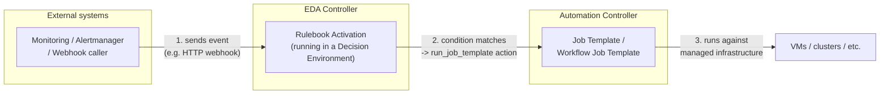

# Chapter 7: Event-Driven Ansible, Explained

Everything built so far — backup, patch, health check, conditional restore
— is **request-driven**: a human (or a schedule) launches the workflow, it
runs from start to finish, and then it's done. If a problem appears *after*
the workflow finishes, nothing happens until someone notices and launches
something again.

**Event-Driven Ansible (EDA)** closes that gap. It lets AAP **listen** for
events from the outside world — monitoring alerts, webhooks, message
queues, log lines — and automatically respond according to rules, at any
time, independent of any specific job run.

## The core idea: "when X happens, do Y"

EDA's entire vocabulary exists to express one sentence:

> **When** an event matching some **condition** arrives from a **source**,
> take an **action**.

Everything below is just the mechanics of how that sentence is written,
packaged, and run.

## Building blocks

### `ansible-rulebook`

The engine. It's the EDA equivalent of `ansible-playbook` — a program that
reads a YAML file and executes it. Instead of running tasks against hosts,
it **listens for events and evaluates rules against them, continuously**.

### Rulebook

A YAML file — the EDA equivalent of a playbook — containing one or more
**rulesets**.

### Ruleset

A named group that combines:

- one or more **sources** (where events come from), and
- a list of **rules** (what to do when an event matches).

### Source

A plugin that connects to an external system and turns its activity into
**events** — JSON data that rules can inspect. EDA ships source plugins for
things like:

- `ansible.eda.webhook` — listen for incoming HTTP POST requests
- `ansible.eda.alertmanager` — receive alerts from Prometheus Alertmanager
- `ansible.eda.kafka` — consume messages from a Kafka topic
- `community.general.file` — watch a file or directory for changes

Each event becomes a structured `event` object that the rule's condition
can reference (e.g., `event.alert.labels.alertname`).

### Rule

A **condition** + **action** pair — the EDA equivalent of a task. When a
new event arrives, every rule in the active ruleset is checked against it;
if the condition evaluates true, the action fires.

### Condition

A boolean expression evaluated against the incoming event's data, e.g.:

```yaml
condition: event.alert.labels.alertname == "VMServiceDown" and event.alert.status == "firing"
```

### Action

What happens when a rule matches. Common actions include:

- `run_job_template` — launch a job template on Automation Controller
- `run_workflow_template` — launch a workflow job template
- `run_playbook` — run a playbook directly (without going through Controller)
- `set_fact` — add data to the ruleset's working memory for later rules
- `post_event` — inject a new event back into the ruleset
- `debug` / `print_event` — for development and troubleshooting

### Decision Environment (DE)

The EDA equivalent of an Execution Environment: a container image bundling
`ansible-rulebook`, the source plugins a rulebook needs, and any
collections its actions depend on (e.g., the collection providing
`run_job_template`).

### EDA Controller

The management layer for all of the above — the EDA equivalent of
Automation Controller. It manages:

- **Rulebook Activations** — running instances of a rulebook inside a DE,
  continuously listening for events
- **Credentials** — e.g., the credential EDA uses to call back into
  Automation Controller's API
- **Event history** — a log of events received and actions taken, for
  audit and troubleshooting

## How the pieces fit together



## A minimal rulebook

This rulebook listens on a webhook and prints every event it receives —
the EDA equivalent of "hello world":

```yaml
---
- name: Minimal example rulebook
  hosts: all
  sources:
    - ansible.eda.webhook:
        host: 0.0.0.0
        port: 5000

  rules:
    - name: Log every incoming event
      condition: true
      action:
        debug:
          msg: "Received an event: {{ event }}"
```

## EDA vocabulary, mapped to familiar AAP concepts

| EDA term | Closest Automation Controller equivalent | What it is |
|---|---|---|
| Decision Environment | Execution Environment | Container image with the runtime + plugins a rulebook needs |
| Rulebook | Playbook | YAML file describing what to watch for and how to react |
| Rulebook Activation | A running Job | A live instance of a rulebook, continuously listening |
| EDA Controller | Automation Controller | Manages activations, credentials, and history |
| Source | *(no direct equivalent)* | Plugin that turns external activity into events |
| Rule (condition + action) | Task | The "if X then Y" unit of work |

## From "reactive workflow" to "self-healing"

The workflow built in Chapter 6 is reactive *within a single run*: it
checks health immediately after patching and restores if needed — but only
*during that run*. EDA extends the same reaction to **any time, any
source**:

| | Chapter 6 workflow | Chapter 8 (EDA) |
|---|---|---|
| Trigger | Manual launch / schedule | Any external event, any time |
| Health signal | Health check inside the same job run | Monitoring alert, possibly hours later |
| Scope | One workflow execution | Continuously running, fleet-wide |
| Action on failure | Restore step in the same workflow | Calls Automation Controller to launch the restore job template |

The next chapter applies exactly this to our use case: a VM that passes its
immediate post-patch health check but **fails hours later** — and gets
restored automatically, with no one watching.
