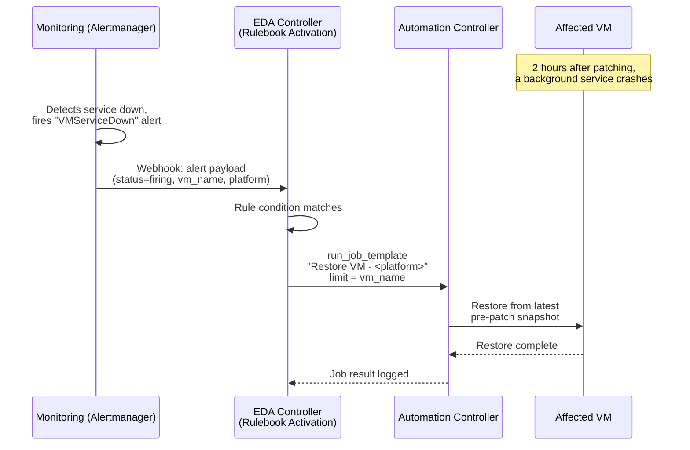

# Chapter 8: EDA in Action — Self-Healing VMs

## The gap

The workflow from Chapter 6 checks VM health **immediately** after
patching. But some patch-related failures don't show up immediately —
they show up later, when a specific code path finally runs:

> A VM is patched. The workflow's health check passes — the critical
> service is active, the port responds, everything looks fine. The
> workflow finishes successfully. **Two hours later**, a scheduled job on
> that VM hits a code path affected by the patch, and a background service
> crashes. The VM is now unhealthy — but no AAP job is running to notice.

The fleet's existing monitoring system (e.g., Prometheus Alertmanager)
*does* notice — it already pages on-call when that service goes down. The
goal of this chapter: instead of paging a human at 2 AM, let **Event-Driven
Ansible turn that alert directly into a restore**.

## The plan



This requires three additions to what's already built:

1. A **Rulebook Activation** running continuously in EDA Controller,
   listening for alerts.
2. A small change to the restore playbooks from Chapter 6, so they can
   restore the **most recent pre-patch snapshot** without needing a
   `snapshot_name` artifact from a specific workflow run (this restore is
   happening *independently* of any workflow execution).
3. A **credential in EDA Controller** that lets the rulebook call back into
   Automation Controller's API.

## 1. The rulebook

```yaml
# rulebooks/self_heal_vm.yml
---
- name: Self-heal VMs after delayed post-patch failures
  hosts: all
  sources:
    - ansible.eda.alertmanager:
        host: 0.0.0.0
        port: 5050

  rules:
    - name: Restore OpenShift Virtualization VM on delayed service failure
      condition: >-
        event.alert.status == "firing" and
        event.alert.labels.alertname == "VMServiceDown" and
        event.alert.labels.platform == "ocpvirt"
      action:
        run_job_template:
          name: "Restore VM - OpenShift Virtualization"
          organization: "VM Operations"
          job_args:
            limit: "{{ event.alert.labels.vm_name }}"
            extra_vars:
              restore_source: "latest-pre-patch"

    - name: Restore VMware VM on delayed service failure
      condition: >-
        event.alert.status == "firing" and
        event.alert.labels.alertname == "VMServiceDown" and
        event.alert.labels.platform == "vmware"
      action:
        run_job_template:
          name: "Restore VM - VMware"
          organization: "VM Operations"
          job_args:
            limit: "{{ event.alert.labels.vm_name }}"
            extra_vars:
              restore_source: "latest-pre-patch"
```

This rulebook is activated once, in EDA Controller, using a **Decision
Environment** that includes the `ansible.eda` collection (for the
`alertmanager` source and `run_job_template` action). It then runs
continuously — no schedule, no manual launch — for as long as the
activation is enabled.

## 2. Restoring without a workflow artifact

In Chapter 6, the restore playbook received `snapshot_name` as a workflow
**artifact** — it knew exactly which snapshot belonged to the run that just
failed. Here, there *is* no current workflow run; EDA is calling the
restore job template on its own, hours after the fact. The fix: if
`snapshot_name` isn't supplied, **look up the most recent `pre-patch-*`
snapshot for this VM** and use that.

```yaml
# Addition to playbooks/restore_ocpvirt.yml
- name: Look up the latest pre-patch snapshot if none was supplied
  when: snapshot_name is not defined
  block:
    - name: List snapshots for {{ inventory_hostname }}
      kubernetes.core.k8s_info:
        api_version: snapshot.kubevirt.io/v1beta1
        kind: VirtualMachineSnapshot
        namespace: "{{ ocpvirt_namespace }}"
        label_selectors:
          - "vm-name={{ inventory_hostname }}"
      register: snapshots

    - name: Select the newest one
      ansible.builtin.set_fact:
        snapshot_name: >-
          {{ (snapshots.resources
              | selectattr('metadata.name', 'match', '^pre-patch-')
              | sort(attribute='metadata.creationTimestamp')
              | last).metadata.name }}
```

```yaml
# Addition to playbooks/restore_vmware.yml
- name: Look up the latest pre-patch snapshot if none was supplied
  when: snapshot_name is not defined
  block:
    - name: Gather snapshot info for {{ inventory_hostname }}
      community.vmware.vmware_guest_snapshot_info:
        validate_certs: false
        datacenter: "{{ vcenter_datacenter }}"
        folder: "{{ vcenter_folder }}"
        name: "{{ inventory_hostname }}"
      register: snap_info

    - name: Select the newest one
      ansible.builtin.set_fact:
        snapshot_name: >-
          {{ (snap_info.guest_snapshots.snapshots
              | selectattr('name', 'match', '^pre-patch-')
              | sort(attribute='create_time')
              | last).name }}
```

The same job templates (`Restore VM - OpenShift Virtualization`,
`Restore VM - VMware`) now serve **two callers**: the Chapter 6 workflow
(which passes `snapshot_name` directly) and the Chapter 8 rulebook (which
doesn't) — no duplication needed.

## 3. Letting EDA call Automation Controller

The `run_job_template` action needs permission to launch job templates on
Automation Controller. This is configured once, as a credential on the
Rulebook Activation:

| Setting | Value |
|---|---|
| Credential type | *Red Hat Ansible Automation Platform* |
| Host | Automation Controller URL |
| Token | A token for a service account with launch permission on the two `Restore VM - *` job templates |

## Why this matters

| | Without EDA | With EDA |
|---|---|---|
| Delayed failure detected by | Monitoring pages on-call | Monitoring fires alert → EDA acts |
| Who restores the VM | A human, manually, under time pressure | Automation Controller, via the existing restore job template |
| Time to restore | Minutes to hours (depends on response time) | Seconds to minutes |
| Audit trail | Whatever the human remembers to log | EDA event log + Automation Controller job history |
| Scope | One VM at a time, reactively | Every VM in the fleet, continuously |

This is the same restore mechanism built in Chapter 6 — EDA doesn't
replace it, it **extends its reach** to failures the original workflow
could never see, because they happen after the workflow has already ended.

## A note on safety

Auto-remediation needs guardrails. In a production setup, this rulebook
would typically also:

- Limit how many automatic restores can happen per VM per day (to avoid a
  restore → re-patch → fail → restore loop).
- Send a notification (Slack, email, ITSM ticket) whenever it acts, so
  humans stay informed even though they didn't have to act.
- Escalate to a human if the restore job template itself fails.

These are additional rules/conditions in the same rulebook — the pattern
doesn't change, only the number of rules.

---

With backup, patch, conditional restore, *and* self-healing all in place,
[Chapter 9](09-two-platforms-one-process.md) steps back and looks at how
much of this is actually platform-specific — and how to reduce the
duplication between the OpenShift Virtualization and VMware paths.
