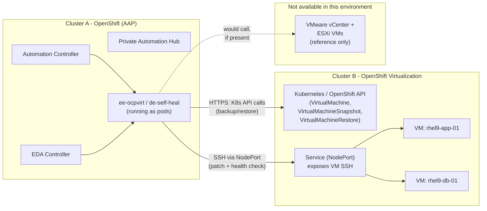

# Working Demo: AAP on OpenShift, Managing OpenShift Virtualization

This directory contains **real, applyable artifacts** that implement the
use case described in [`../chapters/`](../chapters/README.md):
**back up a VM, patch it, health-check it, and automatically restore it
from backup if the patch breaks something** — for VMs running on
**Red Hat OpenShift Virtualization**, orchestrated by **Ansible Automation
Platform installed on a separate OpenShift cluster**.

The VMware path is also implemented, for parity, but is **marked
"reference only — not executed"** throughout, since no VMware
infrastructure is available to run it against.

## Topology

Two **separate clusters/infrastructure**, as specified:

Because the two clusters are independent infrastructure, **every connection
between them is a network call** (HTTPS to the Kubernetes API, SSH to a
NodePort) — there's no shared cluster context, kubeconfig, or filesystem.
[`00-prerequisites.md`](00-prerequisites.md) covers exactly what needs to
exist on each side before anything here will run.

## What's executed vs. reference-only

| Path | Status |
|---|---|
| OpenShift Virtualization: backup, patch, health-check, restore, workflow, EDA self-heal | **Executable** — real playbooks/rulebook/config, ready to run against a real Cluster A + Cluster B |
| VMware vSphere: backup, restore, EDA rule | **Reference only** — same pattern, same file layout, but **not executed** (no VMware infrastructure available). Files are clearly marked at the top with a comment. |

## Directory map

| Path | Contents |
|---|---|
| [`00-prerequisites.md`](00-prerequisites.md) | What must exist on Cluster A and Cluster B before applying anything here |
| [`01-execution-environments/`](01-execution-environments/) | `ee-ocpvirt`, `ee-vmware` (reference), `de-self-heal` build definitions |
| [`02-inventory/`](02-inventory/) | Static inventory + group vars for both platforms |
| [`03-playbooks/`](03-playbooks/) | Backup, patch+health-check, restore playbooks |
| [`04-rulebooks/`](04-rulebooks/) | The EDA self-healing rulebook |
| [`05-controller-as-code/`](05-controller-as-code/) | `ansible.controller` / `ansible.eda` setup playbooks that create every AAP object |
| [`06-running-the-demo.md`](06-running-the-demo.md) | End-to-end steps: apply, launch, break it on purpose, watch it heal |

## How this maps back to the narrative chapters

| Narrative chapter | Implemented here |
|---|---|
| [Ch. 3 — Laying the Foundation](../chapters/03-laying-the-foundation.md) | `01-execution-environments/`, `02-inventory/`, `05-controller-as-code/` (org, credentials, project, inventory) |
| [Ch. 4 — Automating the Backup](../chapters/04-automated-backups.md) | `03-playbooks/backup_ocpvirt.yml` (+ `backup_vmware.yml`, reference) |
| [Ch. 5 — Automating the Patch](../chapters/05-automated-patching.md) | `03-playbooks/patch_and_healthcheck.yml` |
| [Ch. 6 — The Safety Net](../chapters/06-the-safety-net.md) | `03-playbooks/restore_ocpvirt.yml`, workflow nodes in `05-controller-as-code/configure_controller.yml` |
| [Ch. 7–8 — Event-Driven Ansible](../chapters/08-eda-self-healing-usecase.md) | `04-rulebooks/self_heal_vm.yml`, `05-controller-as-code/configure_eda.yml` |
| [Ch. 9 — Two Platforms, One Process](../chapters/09-two-platforms-one-process.md) | `vm_platform` group var in `02-inventory/`, shared workflow shape, VMware reference files throughout |
